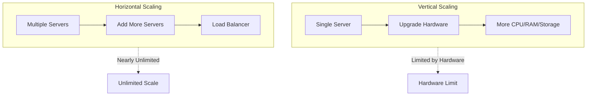
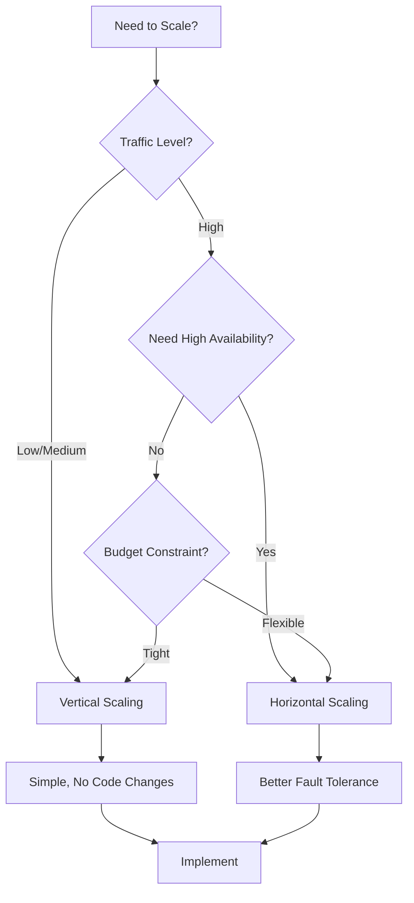

# Scalability Concepts

## Horizontal Scaling vs Vertical Scaling

## Visual Diagrams

### Vertical Scaling (Scale Up) - Diagram

```
BEFORE (Small Server)          AFTER (Upgraded Server)
┌─────────────────┐            ┌─────────────────┐
│   Application   │            │   Application   │
│                 │            │                 │
│  CPU: 2 cores   │   ────>    │  CPU: 8 cores   │
│  RAM: 4 GB     │            │  RAM: 32 GB     │
│  Storage: 100GB │            │  Storage: 1TB   │
└─────────────────┘            └─────────────────┘
     Same Server                  Same Server
   (More Powerful)              (More Powerful)
```

### Horizontal Scaling (Scale Out) - Diagram

```
BEFORE                          AFTER
┌─────────────┐                ┌─────────────┐  ┌─────────────┐  ┌─────────────┐
│ Application │                │ Application │  │ Application │  │ Application │
│  Server 1   │   ────>        │  Server 1   │  │  Server 2   │  │  Server 3   │
│             │                │             │  │             │  │             │
│ CPU: 2 cores│                │ CPU: 2 cores│  │ CPU: 2 cores│  │ CPU: 2 cores│
│ RAM: 4 GB   │                │ RAM: 4 GB   │  │ RAM: 4 GB   │  │ RAM: 4 GB   │
└─────────────┘                └─────────────┘  └─────────────┘  └─────────────┘
                                └─────────────┴─────────────┴─────────────┘
                                         Load Balancer
```

### Comparison Diagram



### Architecture Comparison

```
VERTICAL SCALING                    HORIZONTAL SCALING
─────────────────                  ─────────────────
                                    ┌──────────────┐
┌──────────────┐                   │ Load Balancer│
│              │                   └──────┬───────┘
│   Server     │                         │
│              │            ┌────────────┼────────────┐
│  [Upgraded]  │            │            │            │
│              │            ▼            ▼            ▼
│  More Power  │      ┌─────────┐ ┌─────────┐ ┌─────────┐
│              │      │ Server 1 │ │ Server 2 │ │ Server 3 │
│              │      │          │ │          │ │          │
└──────────────┘      └──────────┘ └──────────┘ └──────────┘
     │                        │            │            │
     └────────────────────────┴────────────┴────────────┘
                        Shared Database
```

### Scaling Decision Flow



### Vertical Scaling (Scale Up)
- **Definition**: Adding more power (CPU, RAM, storage) to existing machines
- **How it works**: Upgrade hardware of current server
- **Pros**:
  - Simple to implement
  - No code changes required
  - No distributed system complexity
- **Cons**:
  - Limited by hardware constraints
  - Single point of failure
  - Expensive at higher levels
  - Downtime required for upgrades
- **Use Cases**: Small to medium applications, databases that don't support horizontal scaling

### Horizontal Scaling (Scale Out)
- **Definition**: Adding more machines to handle increased load
- **How it works**: Add more servers to the pool
- **Pros**:
  - Nearly unlimited scaling potential
  - Better fault tolerance
  - Cost-effective (commodity hardware)
  - No downtime for scaling
- **Cons**:
  - More complex architecture
  - Requires load balancing
  - Data consistency challenges
  - Network latency between nodes
- **Use Cases**: Large-scale applications, cloud-native systems, distributed systems

## Key Differences

| Aspect | Vertical Scaling | Horizontal Scaling |
|--------|-----------------|-------------------|
| **Complexity** | Low | High |
| **Cost** | High (at scale) | Lower (commodity hardware) |
| **Fault Tolerance** | Single point of failure | Distributed, more resilient |
| **Scalability Limit** | Hardware limit | Nearly unlimited |
| **Implementation** | Hardware upgrade | Add more servers |

## Real-World Examples

### Vertical Scaling
- Traditional database servers (MySQL on single machine)
- Small web applications
- Monolithic applications

### Horizontal Scaling
- Web servers (multiple instances)
- Microservices architecture
- Distributed databases (Cassandra, MongoDB sharding)
- Cloud applications (AWS, GCP, Azure)

## Scaling Strategies

### When to Use Vertical Scaling
- Small to medium traffic
- Applications with stateful connections
- When simplicity is priority
- Budget constraints for initial setup

### When to Use Horizontal Scaling
- High traffic applications
- Need for high availability
- Cloud-based applications
- Long-term scalability requirements

## Hybrid Approach
- Start with vertical scaling for simplicity
- Move to horizontal scaling as you grow
- Use vertical scaling for databases (initially)
- Use horizontal scaling for application servers

