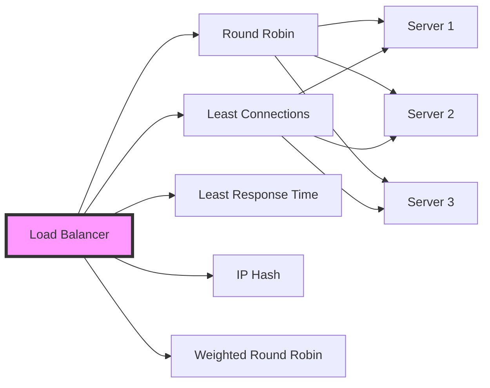
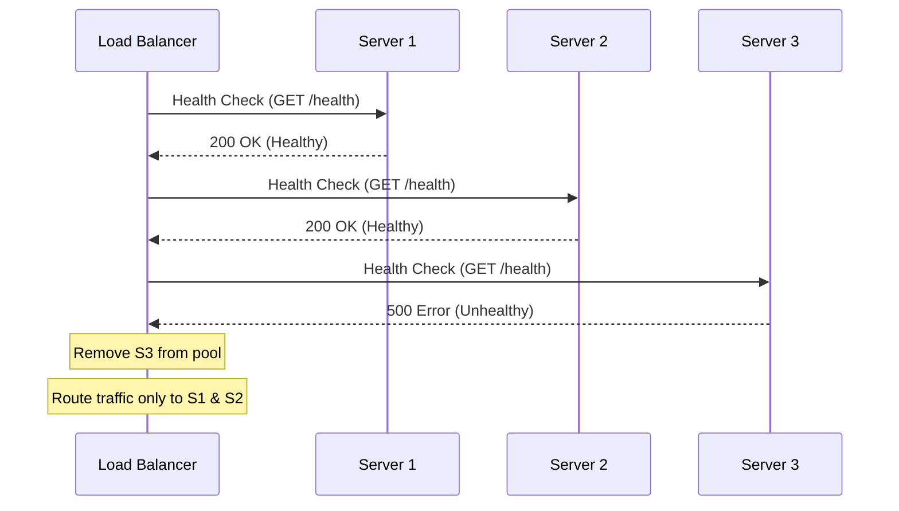

# Load Balancing Strategies

## What is Load Balancing?
Distributing incoming network traffic across multiple servers to ensure no single server is overwhelmed, improving availability and responsiveness.

## Visual Diagrams

### Basic Load Balancer Architecture

```
                    ┌─────────────────┐
                    │   Internet      │
                    │   Users/Client  │
                    └────────┬────────┘
                             │
                             ▼
                    ┌─────────────────┐
                    │  Load Balancer  │
                    │  (Nginx/HAProxy)│
                    └────────┬────────┘
                             │
            ┌────────────────┼────────────────┐
            │                │                │
            ▼                ▼                ▼
    ┌───────────┐    ┌───────────┐    ┌───────────┐
    │ Server 1  │    │ Server 2  │    │ Server 3  │
    │           │    │           │    │           │
    │ App Logic │    │ App Logic │    │ App Logic │
    └───────────┘    └───────────┘    └───────────┘
            │                │                │
            └────────────────┼────────────────┘
                             │
                             ▼
                    ┌─────────────────┐
                    │   Database      │
                    │   (Shared)      │
                    └─────────────────┘
```

### Load Balancing Algorithms - Visual Flow



### Round Robin Algorithm

```
Request Flow:
Request 1 ──> Server 1
Request 2 ──> Server 2
Request 3 ──> Server 3
Request 4 ──> Server 1 (cycle repeats)
Request 5 ──> Server 2
Request 6 ──> Server 3

┌─────────────┐
│ Load Balancer│
└──────┬───────┘
       │
   ┌───┴───┐
   │       │
   ▼       ▼
Server 1  Server 2  Server 3
   ▲       ▲       ▲
   └───────┴───────┘
   (Sequential Distribution)
```

### Least Connections Algorithm

```
Server Status:
Server 1: ████ (4 connections)  ──> NOT SELECTED
Server 2: ██ (2 connections)    ──> SELECTED (Lowest)
Server 3: █████ (5 connections) ──> NOT SELECTED

New Request ──> Routes to Server 2 (fewest connections)
```

### Layer 4 vs Layer 7 Load Balancing

```
LAYER 4 (Transport Layer)          LAYER 7 (Application Layer)
─────────────────────────          ──────────────────────────

┌──────────┐                       ┌──────────┐
│  Client  │                       │  Client  │
└────┬─────┘                       └────┬─────┘
     │                                  │
     │ TCP/UDP                          │ HTTP/HTTPS
     │ IP:Port                          │ Headers/URL/Cookies
     ▼                                  ▼
┌──────────┐                       ┌──────────┐
│   LB     │                       │   LB     │
│ (Layer 4)│                       │ (Layer 7)│
└────┬─────┘                       └────┬─────┘
     │                                  │
     │ Routes by:                       │ Routes by:
     │ - IP Address                     │ - URL Path
     │ - Port Number                    │ - HTTP Headers
     │                                  │ - Cookies
     │                                  │ - Content Type
     ▼                                  ▼
┌──────────┐                       ┌──────────┐
│  Server  │                       │  Server  │
└──────────┘                       └──────────┘
```

### Health Check Mechanism



### Session Persistence (Sticky Sessions)

```
WITHOUT Sticky Sessions          WITH Sticky Sessions
─────────────────────          ─────────────────────

User A Request 1 ──> Server 1   User A Request 1 ──> Server 1
User A Request 2 ──> Server 2   User A Request 2 ──> Server 1 (Same)
User A Request 3 ──> Server 3   User A Request 3 ──> Server 1 (Same)
                                (Session maintained)

Problem: Session lost          Solution: Session preserved
```

### High Availability Load Balancer Setup

```
                    ┌──────────────┐
                    │   DNS/Route  │
                    │   53 / VIP   │
                    └──────┬───────┘
                           │
            ┌──────────────┼──────────────┐
            │                              │
            ▼                              ▼
    ┌──────────────┐            ┌──────────────┐
    │ Load Balancer│            │ Load Balancer│
    │   (Active)   │◄───Heartbeat───►│  (Standby)  │
    └──────┬───────┘            └──────────────┘
            │
    ┌───────┴───────┐
    │               │
    ▼               ▼
┌────────┐     ┌────────┐
│Server 1│     │Server 2│
└────────┘     └────────┘
```

## Types of Load Balancers

### 1. Hardware Load Balancers
- Physical devices (F5, Citrix)
- High performance
- Expensive
- Less flexible

### 2. Software Load Balancers
- Software-based (Nginx, HAProxy, AWS ELB)
- More flexible
- Cost-effective
- Easy to configure

### 3. Cloud Load Balancers
- Managed services (AWS ELB, GCP Load Balancer, Azure Load Balancer)
- Auto-scaling
- Built-in health checks
- Pay-as-you-go

## Load Balancing Algorithms

### 1. Round Robin
- **How it works**: Distributes requests sequentially to each server
- **Pros**: Simple, fair distribution
- **Cons**: Doesn't consider server load or capacity
- **Use Case**: Servers with similar capacity

### 2. Least Connections
- **How it works**: Routes to server with fewest active connections
- **Pros**: Better for long-lived connections
- **Cons**: Requires tracking connections
- **Use Case**: Applications with varying request times

### 3. Least Response Time
- **How it works**: Routes to server with lowest response time
- **Pros**: Optimal performance
- **Cons**: More complex, requires monitoring
- **Use Case**: Performance-critical applications

### 4. IP Hash
- **How it works**: Uses client IP to determine server (consistent hashing)
- **Pros**: Session persistence
- **Cons**: Uneven distribution if IPs are clustered
- **Use Case**: When session affinity is needed

### 5. Weighted Round Robin
- **How it works**: Round robin with weights based on server capacity
- **Pros**: Utilizes server capacity efficiently
- **Cons**: Requires capacity assessment
- **Use Case**: Servers with different capacities

### 6. Weighted Least Connections
- **How it works**: Combines least connections with server weights
- **Pros**: Considers both connections and capacity
- **Cons**: Complex to configure
- **Use Case**: Mixed server environments

## Load Balancer Placement

### Layer 4 (Transport Layer)
- **OSI Layer**: Layer 4
- **Works with**: IP addresses and ports
- **Pros**: Fast, low overhead
- **Cons**: No content awareness
- **Example**: TCP/UDP load balancing

### Layer 7 (Application Layer)
- **OSI Layer**: Layer 7
- **Works with**: HTTP headers, URLs, cookies
- **Pros**: Content-aware routing, SSL termination
- **Cons**: Higher overhead, more complex
- **Example**: HTTP/HTTPS load balancing

## Health Checks

### Active Health Checks
- Load balancer actively probes servers
- Periodic requests to health endpoints
- Removes unhealthy servers from pool

### Passive Health Checks
- Monitors actual request responses
- Removes server after failed requests
- Less overhead than active checks

## Session Persistence (Sticky Sessions)

### Why Needed?
- Some applications require user sessions on same server
- Shopping carts, user authentication

### Methods:
1. **Cookie-based**: Server sets cookie with server identifier
2. **IP-based**: Route based on client IP hash
3. **Application-level**: Session ID in URL or header

### Trade-offs:
- **Pros**: Maintains session state
- **Cons**: Uneven load distribution, harder to scale

## Load Balancer Architectures

### Single Load Balancer
- One load balancer for all traffic
- Simple but single point of failure

### Multiple Load Balancers
- Active-passive: One active, one standby
- Active-active: Both handle traffic
- Requires DNS or floating IP

## Real-World Examples

### AWS Elastic Load Balancer (ELB)
- Application Load Balancer (Layer 7)
- Network Load Balancer (Layer 4)
- Classic Load Balancer

### Nginx
- Popular software load balancer
- High performance
- Reverse proxy capabilities

### HAProxy
- Open-source load balancer
- High availability
- Advanced routing rules

## Best Practices

1. **Health Checks**: Implement proper health check endpoints
2. **Monitoring**: Monitor load balancer and backend servers
3. **Redundancy**: Use multiple load balancers for high availability
4. **SSL Termination**: Handle SSL at load balancer level
5. **Connection Pooling**: Reuse connections efficiently
6. **Graceful Shutdown**: Drain connections before removing servers

