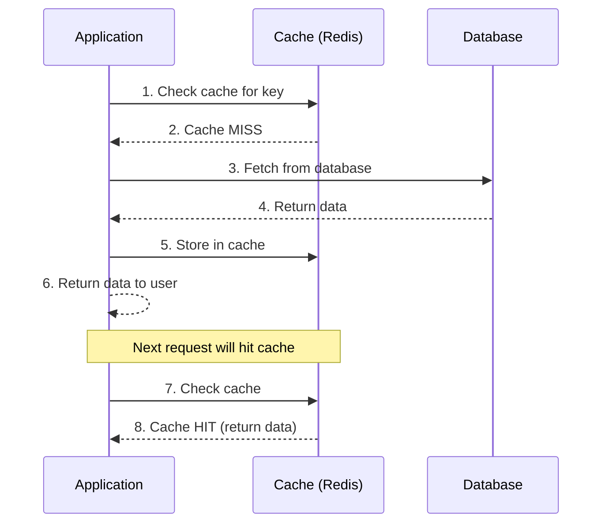
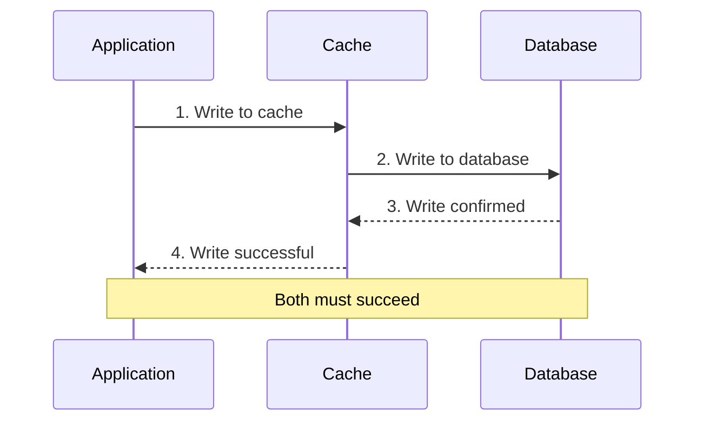
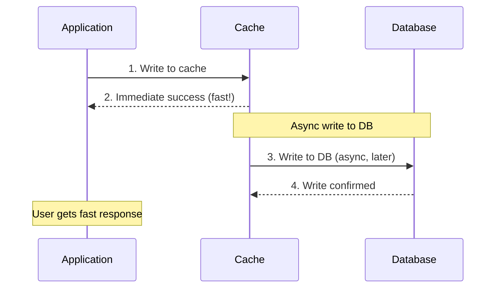
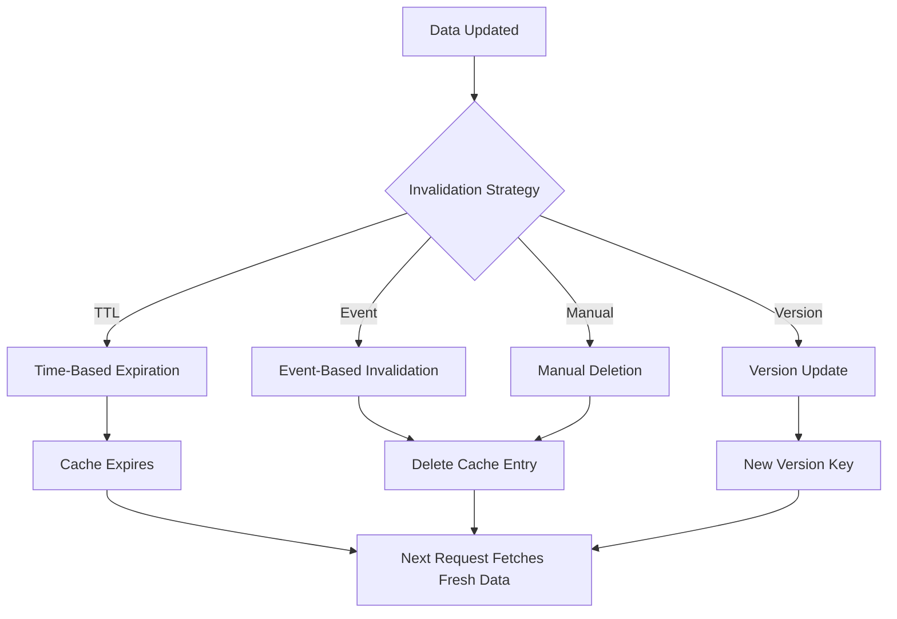

# Caching Strategies

## What is Caching?
Storing frequently accessed data in fast storage (memory) to reduce latency and database load.

## Visual Diagrams

### Cache Layers Architecture

```
┌─────────────────────────────────────────────────────────┐
│                    CLIENT LAYER                          │
│  ┌──────────┐  ┌──────────┐  ┌──────────┐              │
│  │ Browser  │  │ Mobile   │  │  App     │              │
│  │  Cache   │  │  Cache   │  │  Cache   │              │
│  └──────────┘  └──────────┘  └──────────┘              │
└─────────────────────────────────────────────────────────┘
                          │
                          ▼
┌─────────────────────────────────────────────────────────┐
│                    CDN LAYER                            │
│  ┌──────────┐  ┌──────────┐  ┌──────────┐              │
│  │ Edge 1   │  │ Edge 2   │  │ Edge 3   │              │
│  │ (US)     │  │ (EU)     │  │ (Asia)   │              │
│  └──────────┘  └──────────┘  └──────────┘              │
└─────────────────────────────────────────────────────────┘
                          │
                          ▼
┌─────────────────────────────────────────────────────────┐
│              REVERSE PROXY CACHE LAYER                   │
│  ┌──────────┐  ┌──────────┐                            │
│  │  Nginx   │  │  Varnish │                            │
│  │  Cache   │  │  Cache   │                            │
│  └──────────┘  └──────────┘                            │
└─────────────────────────────────────────────────────────┘
                          │
                          ▼
┌─────────────────────────────────────────────────────────┐
│              APPLICATION CACHE LAYER                     │
│  ┌──────────┐  ┌──────────┐                            │
│  │  Redis   │  │ Memcached│                            │
│  │  Cache   │  │  Cache   │                            │
│  └──────────┘  └──────────┘                            │
└─────────────────────────────────────────────────────────┘
                          │
                          ▼
┌─────────────────────────────────────────────────────────┐
│                    DATABASE LAYER                        │
│  ┌──────────┐  ┌──────────┐                            │
│  │ Database │  │ Database │                            │
│  │  Cache   │  │  Query   │                            │
│  └──────────┘  └──────────┘                            │
└─────────────────────────────────────────────────────────┘
```

### Cache-Aside Pattern (Lazy Loading)



### Write-Through Pattern



### Write-Back Pattern (Write-Behind)



### Cache Hit vs Cache Miss

```
CACHE HIT (Fast Path)              CACHE MISS (Slow Path)
────────────────────              ────────────────────

Request                            Request
   │                                  │
   ▼                                  ▼
┌────────┐                        ┌────────┐
│ Cache  │                        │ Cache  │
│  ✓     │                        │  ✗     │
└───┬────┘                        └───┬────┘
    │                                  │
    │ Return (Fast)                    │
    │                                  ▼
    │                            ┌────────┐
    │                            │Database│
    │                            └───┬────┘
    │                                │
    │                                │ Query (Slow)
    │                                │
    │                                ▼
    │                            ┌────────┐
    │                            │ Cache  │
    │                            │ (Store)│
    │                            └────────┘
    │                                │
    └────────────────────────────────┘
            Return to User
```

### Distributed Cache Architecture

```
REPLICATED CACHE                  PARTITIONED CACHE
─────────────────                ─────────────────

┌──────────┐                     ┌──────────┐
│ Cache 1  │                     │ Cache 1  │
│ [A,B,C]  │                     │ [A, D]   │
└──────────┘                     └──────────┘
                                  │
┌──────────┐                     │ Hash(A) → Cache 1
│ Cache 2  │                     │ Hash(B) → Cache 2
│ [A,B,C]  │                     │ Hash(C) → Cache 3
└──────────┘                     │ Hash(D) → Cache 1
                                  │
┌──────────┐                     ▼
│ Cache 3  │                ┌──────────┐
│ [A,B,C]  │                │ Cache 2  │
└──────────┘                │ [B, E]   │
                            └──────────┘
Same data on all nodes      ┌──────────┐
                            │ Cache 3  │
                            │ [C, F]   │
                            └──────────┘
                            Data split across nodes
```

### Cache Invalidation Flow



### LRU (Least Recently Used) Eviction

```
Cache State (Size: 3)          New Item Added
─────────────────────          ───────────────

┌─────────┐                    ┌─────────┐
│ Key: A  │ ← Most Recent      │ Key: D  │ ← New (Most Recent)
│ Value:1 │                    │ Value:4 │
└─────────┘                    └─────────┘
┌─────────┐                    ┌─────────┐
│ Key: B  │                    │ Key: A  │
│ Value:2 │                    │ Value:1 │
└─────────┘                    └─────────┘
┌─────────┐                    ┌─────────┐
│ Key: C  │ ← Least Recent     │ Key: B  │
│ Value:3 │   (Will be evicted)│ Value:2 │
└─────────┘                    └─────────┘
                                (C evicted)
```

## Benefits of Caching
- **Reduced Latency**: Faster data access
- **Lower Database Load**: Fewer queries to database
- **Cost Reduction**: Less compute resources needed
- **Better User Experience**: Faster response times
- **Scalability**: Handle more requests with same resources

## Cache Levels

### 1. Client-Side Caching
- **Location**: Browser, mobile app
- **Examples**: Browser cache, HTTP cache headers
- **Lifetime**: Controlled by cache headers
- **Use Case**: Static assets, API responses

### 2. CDN (Content Delivery Network)
- **Location**: Edge servers globally
- **Examples**: CloudFront, Cloudflare
- **Lifetime**: TTL-based or manual invalidation
- **Use Case**: Static content, images, videos

### 3. Reverse Proxy Cache
- **Location**: In front of application servers
- **Examples**: Nginx, Varnish
- **Lifetime**: Configurable TTL
- **Use Case**: HTML pages, API responses

### 4. Application Cache
- **Location**: Application server memory
- **Examples**: In-memory cache (Redis, Memcached)
- **Lifetime**: Application-controlled
- **Use Case**: Database query results, computed values

### 5. Database Cache
- **Location**: Database query cache
- **Examples**: MySQL query cache, PostgreSQL cache
- **Lifetime**: Database-controlled
- **Use Case**: Frequently executed queries

## Caching Patterns

### 1. Cache-Aside (Lazy Loading)
- **How it works**:
  1. Application checks cache first
  2. If miss, fetch from database
  3. Store in cache for future requests
- **Pros**: Simple, cache failures don't break app
- **Cons**: Cache miss penalty, possible stale data
- **Use Case**: Most common pattern, read-heavy workloads

### 2. Write-Through
- **How it works**:
  1. Write to cache and database simultaneously
  2. Both must succeed
- **Pros**: Always consistent, no stale data
- **Cons**: Higher write latency, more writes
- **Use Case**: When consistency is critical

### 3. Write-Back (Write-Behind)
- **How it works**:
  1. Write to cache immediately
  2. Write to database asynchronously later
- **Pros**: Very fast writes, reduced database load
- **Cons**: Risk of data loss, complex implementation
- **Use Case**: Write-heavy workloads, can tolerate some data loss

### 4. Refresh-Ahead
- **How it works**:
  1. Proactively refresh cache before expiration
  2. Background process updates cache
- **Pros**: Reduces cache misses
- **Cons**: Wastes resources if data not accessed
- **Use Case**: Predictable access patterns

## Cache Invalidation Strategies

### 1. TTL (Time To Live)
- Cache expires after fixed time
- Simple but may serve stale data
- Good for data that changes infrequently

### 2. Event-Based Invalidation
- Invalidate cache when data changes
- More complex but ensures freshness
- Requires event system

### 3. Manual Invalidation
- Explicitly delete cache entries
- Full control but requires management
- Good for admin operations

### 4. Version-Based
- Include version in cache key
- Update version when data changes
- Old versions naturally expire

## Cache Replacement Policies

### 1. LRU (Least Recently Used)
- Evicts least recently accessed items
- Good for temporal locality
- Most common policy

### 2. LFU (Least Frequently Used)
- Evicts least frequently accessed items
- Good for stable access patterns
- Tracks access frequency

### 3. FIFO (First In First Out)
- Evicts oldest items
- Simple but may evict hot data
- Less optimal

### 4. Random
- Randomly evicts items
- Simple but unpredictable
- Rarely used

## Distributed Caching

### Challenges
- **Consistency**: Keeping caches in sync
- **Network Latency**: Communication between nodes
- **Partitioning**: Distributing data across nodes

### Solutions

#### 1. Replicated Cache
- Same data on all nodes
- Fast reads, slower writes
- Good for read-heavy workloads

#### 2. Partitioned Cache
- Data split across nodes
- Better memory utilization
- Requires routing logic

#### 3. Hybrid Approach
- Combine replication and partitioning
- Balance between performance and consistency

## Cache Technologies

### Redis
- In-memory data structure store
- Supports complex data types
- Persistence options
- Pub/sub capabilities

### Memcached
- Simple key-value store
- High performance
- No persistence
- Distributed caching

### Hazelcast
- In-memory data grid
- Distributed computing
- Java-based
- Enterprise features

## Best Practices

1. **Cache Key Design**: Use clear, consistent naming
2. **Cache Size**: Monitor and limit cache size
3. **Monitoring**: Track hit/miss ratios
4. **Error Handling**: Handle cache failures gracefully
5. **Warming**: Pre-populate cache for critical data
6. **Expiration**: Set appropriate TTL values
7. **Serialization**: Efficient data serialization
8. **Security**: Secure cache access

## Common Pitfalls

1. **Cache Stampede**: Multiple requests on cache miss
   - Solution: Lock or use probabilistic early expiration

2. **Stale Data**: Serving outdated information
   - Solution: Proper invalidation strategy

3. **Memory Issues**: Cache consuming too much memory
   - Solution: Set size limits, use eviction policies

4. **Cache Penetration**: Queries for non-existent data
   - Solution: Cache negative results with short TTL

5. **Hot Keys**: Single key receiving too many requests
   - Solution: Replicate or partition hot data

