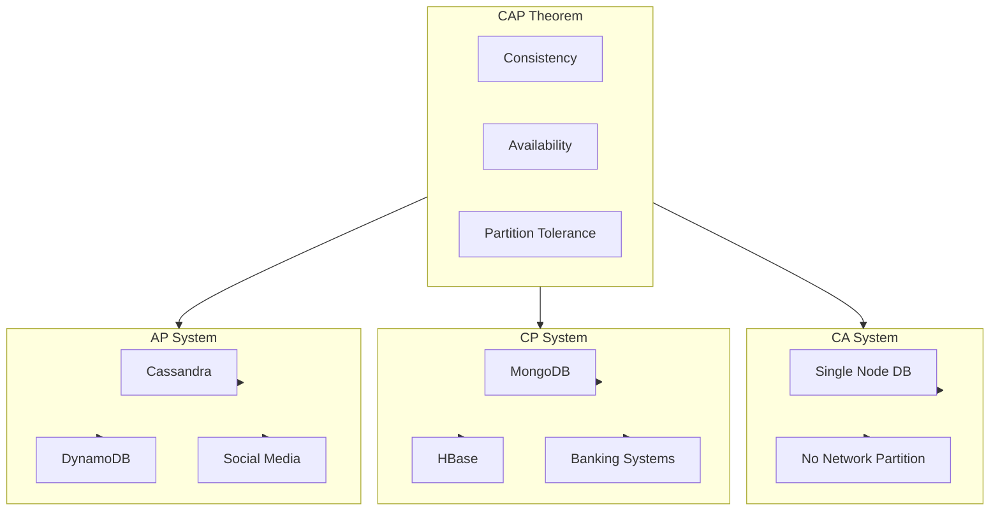
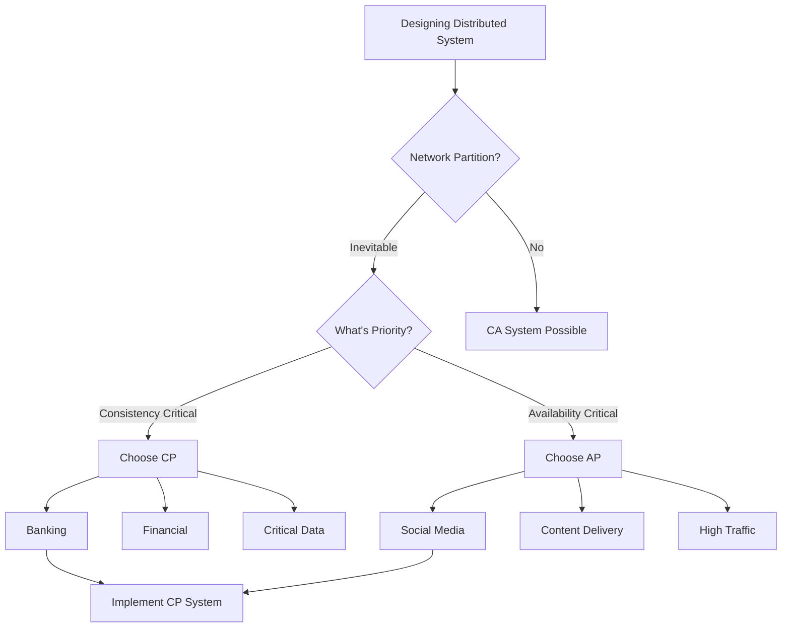

# CAP Theorem Basics

## What is CAP Theorem?
CAP Theorem states that in a distributed system, you can only guarantee **two out of three** properties:

- **C**onsistency
- **A**vailability
- **P**artition tolerance

## Visual Diagrams

### CAP Theorem Triangle

```
                    CONSISTENCY (C)
                         /\
                        /  \
                       /    \
                      /      \
                     /        \
                    /          \
                   /            \
                  /              \
                 /                \
                /                  \
               /                    \
              /                      \
             /                        \
            /                          \
           /                            \
          /                              \
    PARTITION TOLERANCE (P) ──────────── AVAILABILITY (A)
    
    You can only choose 2 out of 3!
```

### CAP Combinations Visual



### CP System Behavior (Consistency + Partition Tolerance)

```
NORMAL OPERATION                    NETWORK PARTITION
──────────────────                  ──────────────────

┌──────────┐                        ┌──────────┐
│ Node 1   │                        │ Node 1   │
│ Data: X  │                        │ Data: X  │
└────┬─────┘                        └──────────┘
     │                                    │
     │ Sync                               │
     │                                    │ Network Split
     ▼                                    │
┌──────────┐                        ┌────┴─────┐
│ Node 2   │                        │ Node 2   │
│ Data: X  │                        │ Data: X  │
└──────────┘                        └──────────┘

Both nodes consistent            Cannot sync → BLOCK OPERATIONS
                                 (Sacrifice Availability)
                                 
User Request → Rejected/Timeout
(To maintain consistency)
```

### AP System Behavior (Availability + Partition Tolerance)

```
NORMAL OPERATION                    NETWORK PARTITION
──────────────────                  ──────────────────

┌──────────┐                        ┌──────────┐
│ Node 1   │                        │ Node 1   │
│ Data: X  │                        │ Data: X  │
└────┬─────┘                        └──────────┘
     │                                    │
     │ Sync                               │
     │                                    │ Network Split
     ▼                                    │
┌──────────┐                        ┌────┴─────┐
│ Node 2   │                        │ Node 2   │
│ Data: X  │                        │ Data: Y  │ (Updated)
└──────────┘                        └──────────┘

Both nodes consistent            Continue serving requests
                                 (May return stale data)
                                 
User Request → Served immediately
(May get X or Y - Eventual Consistency)
```

### CAP Decision Flow



### Real-World CAP Examples

```
CP SYSTEM (Banking)                AP SYSTEM (Social Media)
───────────────────                ───────────────────────

User Request                       User Request
    │                                  │
    ▼                                  ▼
┌──────────┐                      ┌──────────┐
│  Server  │                      │  Server  │
│          │                      │          │
│ Check    │                      │ Serve    │
│ Balance  │                      │ Feed     │
└────┬─────┘                      └────┬─────┘
     │                                  │
     │ Must be accurate                 │ Can be slightly stale
     │                                  │
     ▼                                  ▼
┌──────────┐                      ┌──────────┐
│ Database │                      │ Cache/CDN│
│ (Strong  │                      │ (Eventual│
│  ACID)   │                      │  Consistency)
└──────────┘                      └──────────┘

If partition:                     If partition:
Reject transaction                Serve cached data
(Sacrifice Availability)          (Sacrifice Consistency)
```

### Eventual Consistency Timeline

```
Time    Node 1        Node 2        Node 3
─────────────────────────────────────────────
T0      X             X             X
        │
        │ Write Y to Node 1
        │
T1      Y             X             X  (Inconsistent)
        │
        │ Replication starts
        │
T2      Y             Y             X  (Partially consistent)
        │
        │ Continue replication
        │
T3      Y             Y             Y  (Eventually consistent)
        
All nodes now have same data (Y)
```

### PACELC Theorem Extension

```
CAP Theorem                    PACELC Extension
───────────                    ────────────────

If Partition (P):              If Partition (P):
  Choose A or C                   Choose A or C
                                  │
                                  │
                                  │ Else (No Partition):
                                  │   Choose Latency (L) or Consistency (C)
                                  │
                                  │ Example:
                                  │ - Read from Replica (Low L, Weak C)
                                  │ - Read from Primary (High L, Strong C)
```

## The Three Properties

### 1. Consistency
- **Definition**: All nodes see the same data at the same time
- **Meaning**: Every read receives the most recent write
- **Example**: After writing to one node, all reads (from any node) return the same value
- **Trade-off**: Requires coordination between nodes, which can slow down writes

### 2. Availability
- **Definition**: System remains operational and responds to requests
- **Meaning**: Every request receives a response (not an error)
- **Example**: System continues to serve requests even if some nodes fail
- **Trade-off**: May return stale or inconsistent data

### 3. Partition Tolerance
- **Definition**: System continues to work despite network failures
- **Meaning**: System operates even if nodes can't communicate
- **Example**: Network split between data centers doesn't break the system
- **Reality**: In distributed systems, network partitions are inevitable

## Why Only Two?

In a distributed system:
- **Network partitions are inevitable** (servers can fail, networks can split)
- When partition occurs:
  - If you choose **Consistency**: Must block writes/reads (sacrifice Availability)
  - If you choose **Availability**: Must serve potentially stale data (sacrifice Consistency)
  - You **cannot** have both during a partition

## CAP Combinations

### CA (Consistency + Availability)
- **No Partition Tolerance**
- **Reality**: Not possible in truly distributed systems
- **Example**: Single-node database, traditional RDBMS (when not replicated)
- **Note**: If no network partition, you can have both C and A

### CP (Consistency + Partition Tolerance)
- **Sacrifices Availability**
- **Behavior**: Blocks operations during partition to maintain consistency
- **Examples**:
  - **MongoDB** (with strong consistency)
  - **HBase**
  - **Redis** (single node or with strong consistency)
  - **Traditional databases** (ACID compliance)
- **Use Case**: When consistency is critical (banking, financial systems)

### AP (Availability + Partition Tolerance)
- **Sacrifices Consistency**
- **Behavior**: Continues serving requests, may return stale data
- **Examples**:
  - **Cassandra**
  - **DynamoDB**
  - **CouchDB**
  - **DNS**
- **Use Case**: When availability is more important than perfect consistency (social media, content delivery)

## Real-World Examples

### CP Systems
```
Banking System
- Must be consistent (account balance)
- Can tolerate brief unavailability
- Network partition: Reject transactions
```

### AP Systems
```
Social Media Feed
- Must be available (users expect to see content)
- Can tolerate slight inconsistency (eventual consistency)
- Network partition: Serve cached/stale data
```

## Eventual Consistency

### What is it?
- System will become consistent over time
- All nodes will eventually have the same data
- Used in AP systems

### Types:
1. **Strong Eventual Consistency**: All nodes converge to same state
2. **Weak Eventual Consistency**: Nodes may have different views temporarily

### Examples:
- **DNS**: Updates propagate eventually
- **Amazon S3**: Eventual consistency model
- **Social Media**: Likes, comments sync eventually

## CAP Theorem Misconceptions

### 1. "You must choose one property to sacrifice"
- **Reality**: You choose which to prioritize, not completely sacrifice
- Systems can be tuned for different scenarios

### 2. "CAP applies to all parts of the system"
- **Reality**: Different parts can have different CAP guarantees
- Example: User data (CP), cache (AP)

### 3. "Partition tolerance is optional"
- **Reality**: In distributed systems, partitions are inevitable
- You must design for partition tolerance

### 4. "CAP is binary"
- **Reality**: It's more of a spectrum
- Systems can be "mostly consistent" or "mostly available"

## Beyond CAP: PACELC Theorem

### PACELC Extension
- **If Partition (P)**: Choose Availability (A) or Consistency (C)
- **Else (E)**: Choose Latency (L) or Consistency (C)

### Meaning:
- During normal operation (no partition), trade-off is between **Latency** and **Consistency**
- Example: Read from replica (lower latency, eventual consistency) vs read from primary (higher latency, strong consistency)

## Design Decisions

### When to Choose CP?
- Financial transactions
- Critical data integrity
- When consistency is legally required
- Can tolerate brief downtime

### When to Choose AP?
- Social media feeds
- Content delivery
- Real-time analytics
- High availability requirements

### Hybrid Approach
- Use CP for critical data (user accounts, payments)
- Use AP for non-critical data (feeds, recommendations)
- Different consistency levels for different operations

## Best Practices

1. **Understand Requirements**: What's more important for your use case?
2. **Design for Failure**: Assume partitions will happen
3. **Layer Your Approach**: Different parts can have different guarantees
4. **Monitor**: Track consistency and availability metrics
5. **Document**: Clearly document CAP choices and trade-offs

## Summary

- **CAP Theorem**: Fundamental constraint in distributed systems
- **Reality**: Must choose 2 out of 3 properties
- **Partition Tolerance**: Usually required in distributed systems
- **Choice**: Between Consistency (CP) and Availability (AP)
- **Application**: Design based on business requirements

