# Twitter System Flow Diagrams

## 📊 Detailed Flow Diagrams

### 1. Tweet Creation - Complete Flow

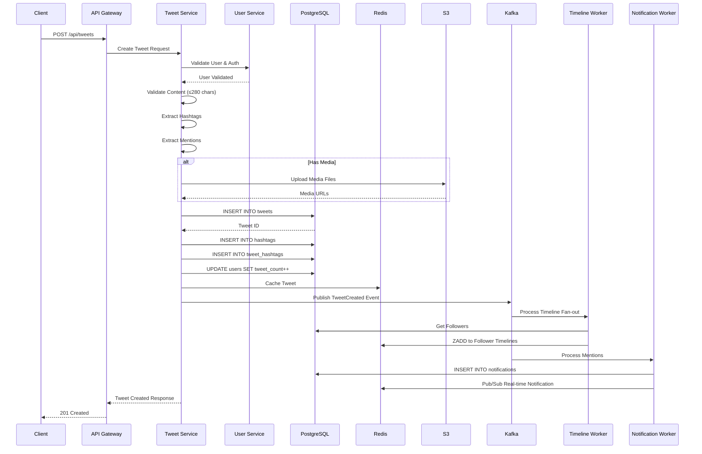

### 2. Timeline Generation - Fan-out on Write

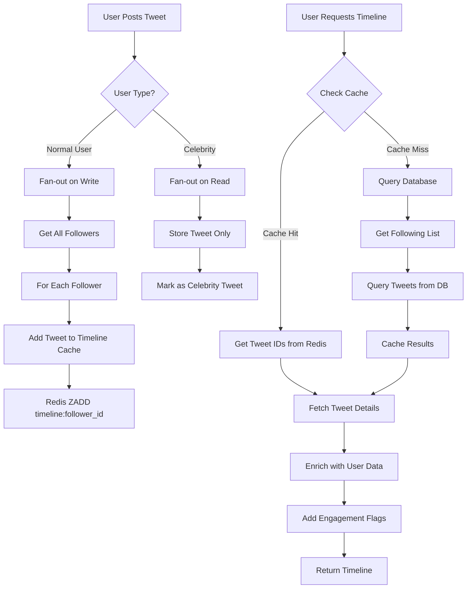

### 3. Follow/Unfollow Flow with Timeline Update

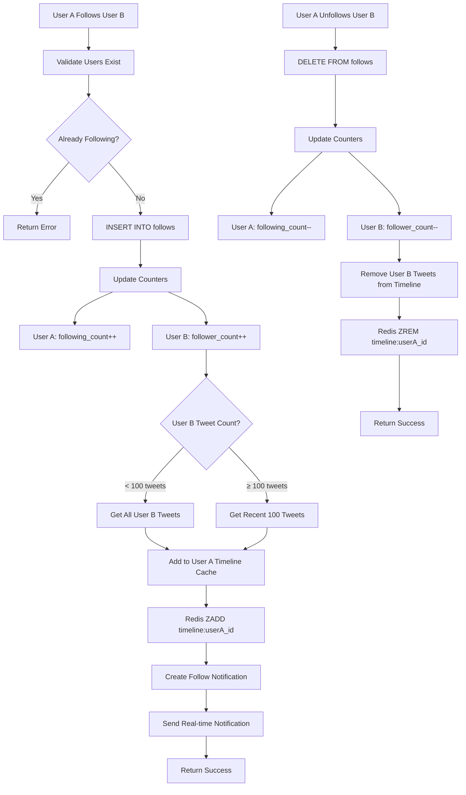

### 4. Like/Unlike Flow with Real-time Updates

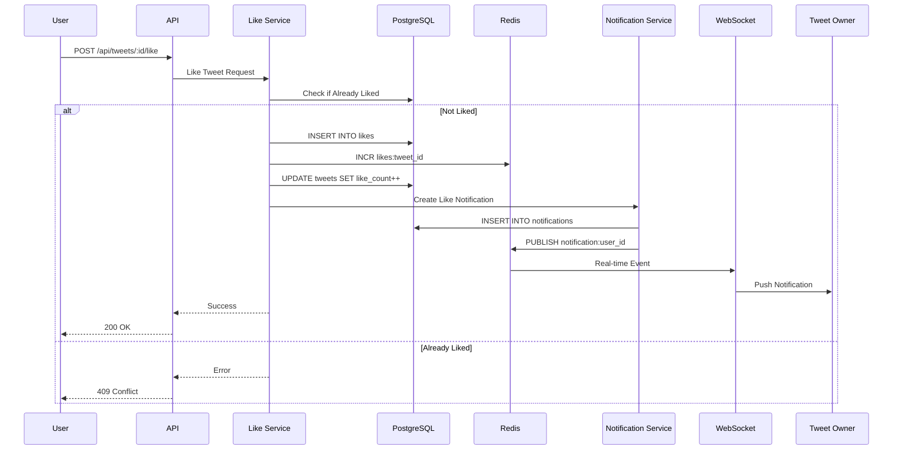

### 5. Search Flow with Elasticsearch

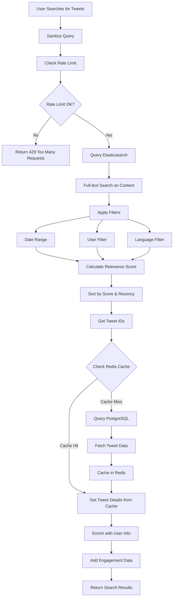

### 6. Trending Topics Algorithm

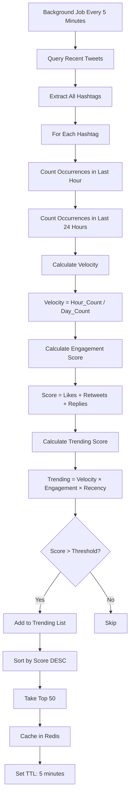

### 7. Notification System Architecture

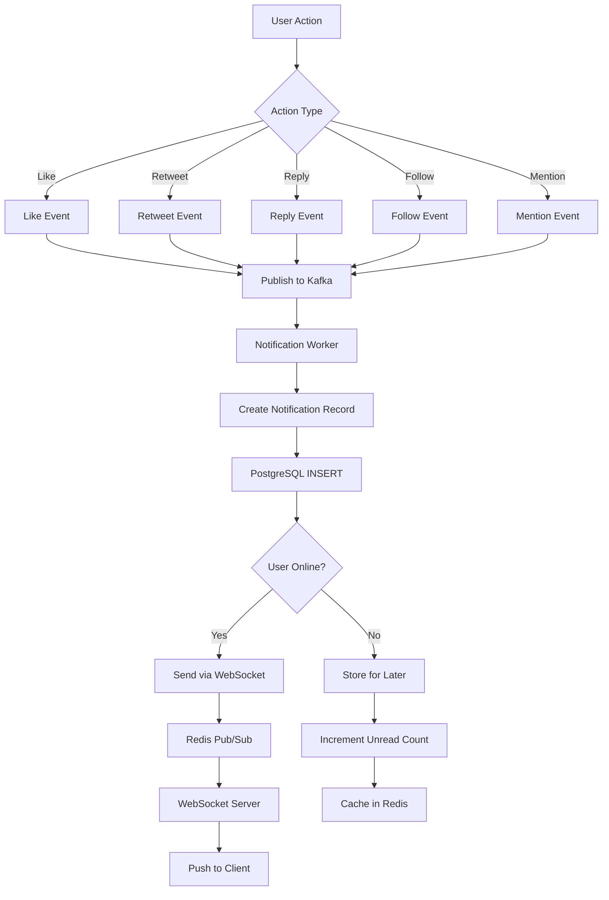

### 8. Direct Message Flow

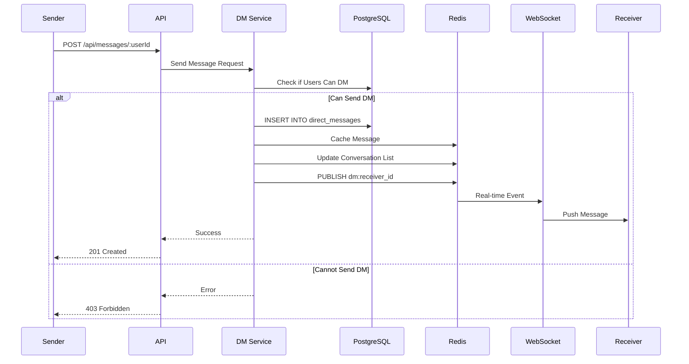

### 9. Media Upload Flow

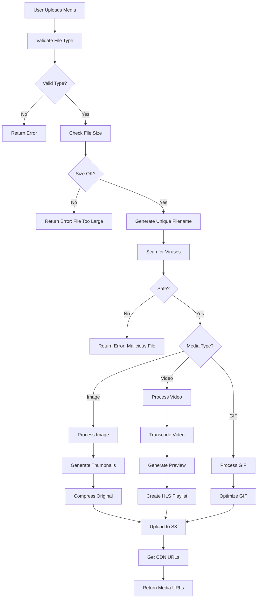

### 10. Rate Limiting Flow

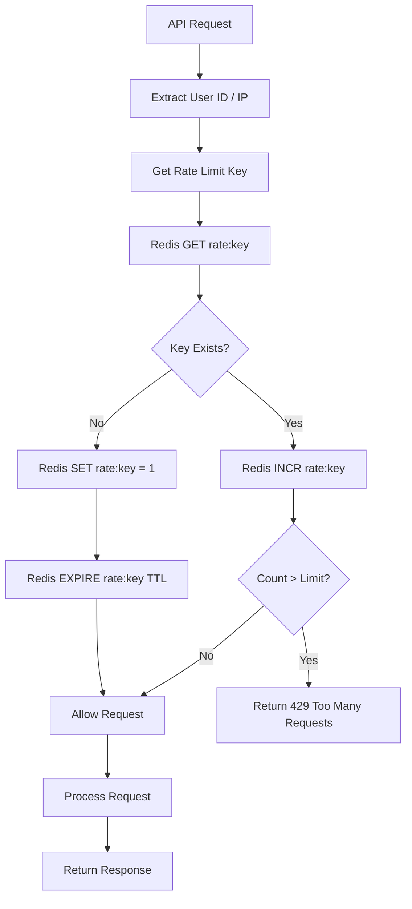

### 11. Cache Invalidation Strategy

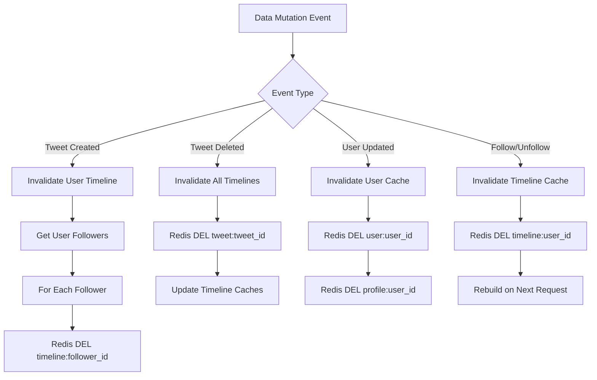

### 12. Database Sharding Strategy

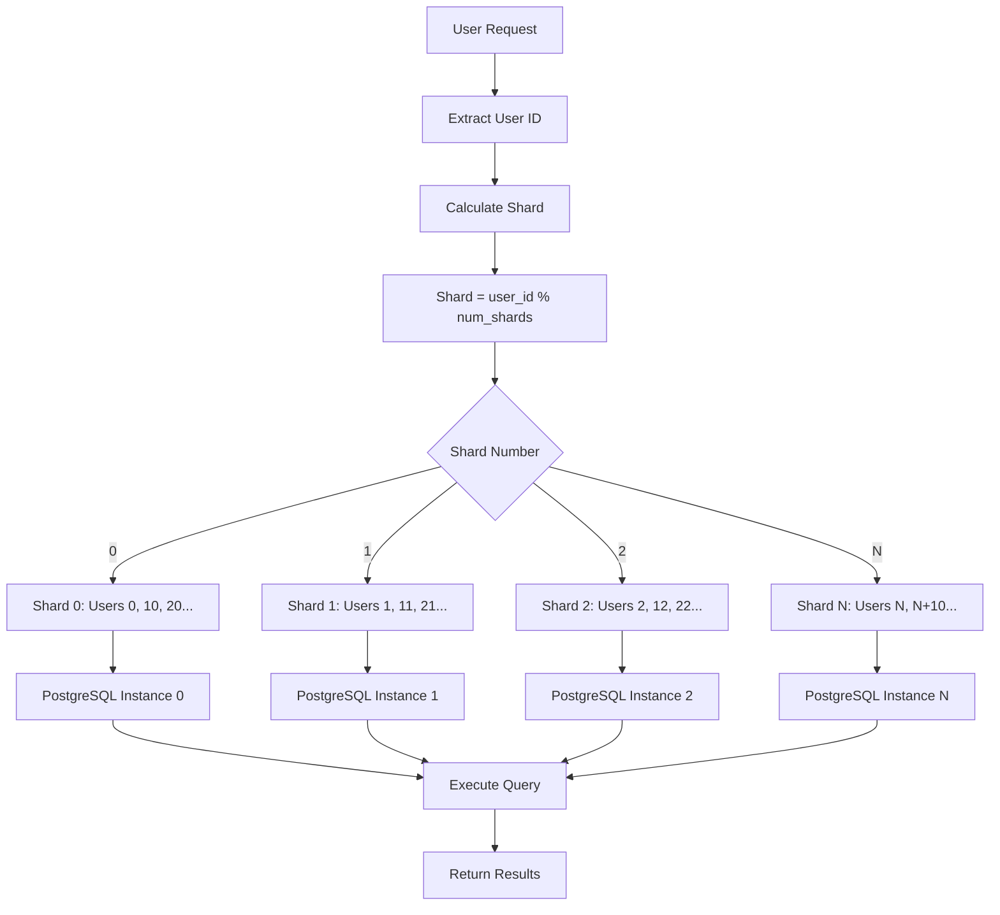

---

## 🔄 Background Workers

### 1. Timeline Fan-out Worker

**Purpose:** Distribute tweets to followers' timelines asynchronously

**Frequency:** Real-time (event-driven)

**Process:**
```typescript
async function timelineFanoutWorker() {
  const consumer = kafka.consumer({ groupId: 'timeline-fanout' });
  
  await consumer.subscribe({ topic: 'tweet-created' });
  
  await consumer.run({
    eachMessage: async ({ message }) => {
      const { tweetId, userId } = JSON.parse(message.value);
      
      // Get followers
      const followers = await getFollowers(userId);
      
      // Fan out to followers
      for (const follower of followers) {
        await redis.zadd(
          `timeline:${follower.id}`,
          tweet.created_at.getTime(),
          tweetId
        );
      }
    }
  });
}
```

### 2. Engagement Counter Worker

**Purpose:** Flush like/retweet counts from Redis to PostgreSQL

**Frequency:** Every 10 seconds

**Process:**
```typescript
async function engagementCounterWorker() {
  setInterval(async () => {
    // Get all like counters
    const likeKeys = await redis.keys('likes:*');
    
    for (const key of likeKeys) {
      const tweetId = key.replace('likes:', '');
      const count = await redis.get(key);
      
      if (count > 0) {
        await db.query(
          'UPDATE tweets SET like_count = like_count + $1 WHERE id = $2',
          [count, tweetId]
        );
        
        await redis.del(key);
      }
    }
  }, 10000);
}
```

### 3. Trending Topics Worker

**Purpose:** Calculate and update trending topics

**Frequency:** Every 5 minutes

**Process:**
```typescript
async function trendingTopicsWorker() {
  setInterval(async () => {
    // Get hashtags from last hour
    const recentHashtags = await getRecentHashtags(1); // 1 hour
    
    // Calculate trending scores
    const trending = [];
    for (const hashtag of recentHashtags) {
      const score = await calculateTrendingScore(hashtag);
      trending.push({ hashtag, score });
    }
    
    // Sort and cache top 50
    trending.sort((a, b) => b.score - a.score);
    const top50 = trending.slice(0, 50);
    
    await redis.setex('trending:topics', 300, JSON.stringify(top50));
  }, 300000); // 5 minutes
}
```

### 4. Notification Delivery Worker

**Purpose:** Process and deliver notifications

**Frequency:** Real-time (event-driven)

**Process:**
```typescript
async function notificationWorker() {
  const consumer = kafka.consumer({ groupId: 'notifications' });
  
  await consumer.subscribe({ topic: 'user-actions' });
  
  await consumer.run({
    eachMessage: async ({ message }) => {
      const event = JSON.parse(message.value);
      
      // Create notification
      const notification = await createNotification(event);
      
      // Check if user is online
      const isOnline = await redis.get(`online:${event.targetUserId}`);
      
      if (isOnline) {
        // Send via WebSocket
        await sendRealtimeNotification(event.targetUserId, notification);
      } else {
        // Store for later
        await redis.incr(`unread:${event.targetUserId}`);
      }
    }
  });
}
```

### 5. Search Index Worker

**Purpose:** Index tweets in Elasticsearch

**Frequency:** Real-time (event-driven)

**Process:**
```typescript
async function searchIndexWorker() {
  const consumer = kafka.consumer({ groupId: 'search-indexer' });
  
  await consumer.subscribe({ topic: 'tweet-created' });
  
  await consumer.run({
    eachMessage: async ({ message }) => {
      const tweet = JSON.parse(message.value);
      
      // Index in Elasticsearch
      await esClient.index({
        index: 'tweets',
        id: tweet.id,
        body: {
          content: tweet.content,
          user_id: tweet.user_id,
          created_at: tweet.created_at,
          like_count: tweet.like_count,
          retweet_count: tweet.retweet_count
        }
      });
    }
  });
}
```

---

## 📊 Performance Benchmarks

### Expected Latencies

| Operation | Target | Acceptable | Notes |
|-----------|--------|------------|-------|
| Tweet Creation | < 200ms | < 500ms | Including fan-out initiation |
| Timeline Load (cached) | < 100ms | < 300ms | From Redis |
| Timeline Load (uncached) | < 500ms | < 1s | From PostgreSQL |
| Search Query | < 500ms | < 1s | Elasticsearch |
| Like/Unlike | < 100ms | < 200ms | Redis increment |
| Follow/Unfollow | < 200ms | < 500ms | Including counter updates |
| Notification Delivery | < 100ms | < 200ms | Real-time via WebSocket |
| Media Upload | < 2s | < 5s | Depends on file size |

### Cache Hit Rates

| Cache Type | Target Hit Rate | Notes |
|------------|----------------|-------|
| Timeline Cache | > 90% | For active users |
| Tweet Cache | > 80% | For popular tweets |
| User Profile Cache | > 95% | Frequently accessed |
| Search Results Cache | > 70% | Common queries |

### Database Query Performance

| Query Type | Target | Index Strategy |
|------------|--------|----------------|
| Get User Timeline | < 50ms | Composite index on (user_id, created_at) |
| Get Tweet by ID | < 10ms | Primary key lookup |
| Get Followers | < 100ms | Index on follower_id |
| Search Tweets | < 200ms | Elasticsearch full-text index |

---

## 🎯 Capacity Planning

### Storage Growth

| Year | Users | Tweets | Storage |
|------|-------|--------|---------|
| Year 1 | 100M | 182B | 109 PB |
| Year 2 | 200M | 365B | 219 PB |
| Year 3 | 350M | 638B | 383 PB |
| Year 5 | 500M | 912B | 547 PB |

### Infrastructure Requirements

**Application Servers:**
- Initial: 60 servers
- Year 1: 100 servers
- Year 3: 200 servers
- Year 5: 300 servers

**Database Shards:**
- Initial: 10 shards
- Year 1: 50 shards
- Year 3: 100 shards
- Year 5: 200 shards

**Redis Cluster:**
- Initial: 10 nodes
- Year 1: 20 nodes
- Year 3: 40 nodes
- Year 5: 60 nodes

**Elasticsearch Cluster:**
- Initial: 10 nodes
- Year 1: 20 nodes
- Year 3: 40 nodes
- Year 5: 60 nodes
